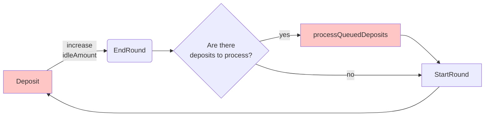

<p align="center"> Pods - Yield </p>


<p align="center">
  <a href="https://github.com/pods-finance/lisbon/actions?query=workflow:test">
    
  </a>
  
  <a href='https://coveralls.io/github/pods-finance/lisbon?branch=main'>
    
  </a>

  <a href="http://gplv3.fsf.org/">
    
  </a>

# Overview / Context

In this new project, Pods team is launching a 1-click strategy product. This strategy will consist of:

A) Invest the principal amount of the investment in a type of Yield Source (Lido, AAVE, AMM Pools). But we will begin only with Lido.

B) Use part of the yield generated weekly to buy weekly Call Options on ETH 10-20% OTM. 

That way, you don't ever touch the principal and only take risks with the profit. This type of strategy is called Principal Protected.

# Points of centralization

 Although we wished to build a strategy fully on-chain, for some reasons its not possible right now. On the part B) (Buying weekly options) we dont have yet mature option protocols in the market with enough liquidity and low slippage.
  So, under the hood, on the part B of the process, we transfer part of the yield to a Multisig that will have the freedom to find the best place to buy those options (Ribbon auction / Pods AMM / OTC with Market Makers).

 In case of Multisig hack, the only balances that **the Multisig have access are the yield generated between rounds**.

 # Operation Flowchart
Red -> Any address can call this function

Black -> Only the Vault Controller



 # System Actors

### Investor 
That EOA or a contract can interact with three functions: deposit, withdraw and processDeposits.

### Vault Controller
That vault controller have the power to:
- Start round
- Proccess deposits
- End round

# Steps

## End Round
During end round the vault will perform 3 things:

a) Set the flag `isProcessingDeposits` to true. This should block any deposit or withdraw.

b) Check the interest generated between rounds

c) Pull tokens from the investor contract (The Multisig that will be responsible for the options operation). If the option from the last week ended up ITM, the Investor should leave the profit available in the contract before the Vault Controller calls the End Round function

d) After checking interest generated, part of that yield will be transfered back to investor Multisig based on the investorRatio variable.

## Start Round
During this step, we perform the following logics:

a) Reanable deposits and withdraws by setting the `isProcessingDeposits` to false.

b) Store the initial round balance and initial round share price.

## Test

```shell
npx hardhat test
```
## Deploy and config

Deploy the contracts

```shell
npx hardhat run ./scripts/deployTestnet.ts --network <network>
```
Populate the system with a few transactions
```shell
npx hardhat run ./scripts/populateTestnet.ts --network <network>
```
