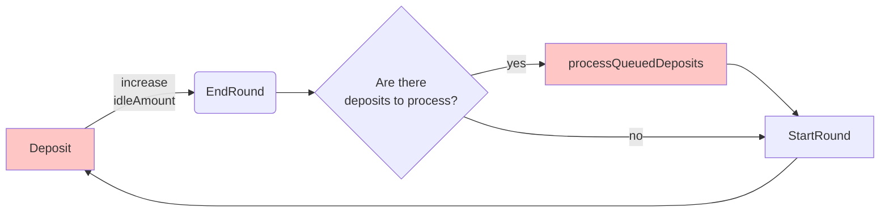

<p align="center"> Pods - Yield </p>


<p align="center">
  <a href="https://github.com/pods-finance/lisbon/actions?query=workflow:test">
    
  </a>
  
  <a href='https://coveralls.io/github/pods-finance/yield-contracts?branch=main'>
    
  </a>

  <a href="http://gplv3.fsf.org/">
    
  </a>
  
  


# Index

- [Index](#index)
  - [Context](#context)
  - [Whitepaper](#whitepaper)
  - [Access Controls](#access-controls)
    - [TLDR:](#tldr)
    - [VaultController](#vaultcontroller)
    - [ConfigurationManager Owner](#configurationmanager-owner)
    - [Investor](#investor)
  - [Operation Flowchart](#operation-flowchart)
  - [System Actors](#system-actors)
    - [User](#user)
    - [Investor](#investor-1)
    - [Vault Controller](#vault-controller)
  - [Steps](#steps)
    - [End Round](#end-round)
    - [Start Round](#start-round)
  - [Tests](#tests)
  - [Fuzzy Test](#fuzzy-test)
  - [Deploy and config](#deploy-and-config)
  - [Contracts Addresses](#contracts-addresses)
  - [Bug Bounty Program](#bug-bounty-program)
  - [Coverage Results](#coverage-results)
  - [Team Contact](#team-contact)

## Context

In this new project, Pods team is launching a 1-click exposure to strategy. The strategy consists in:

A) Allocate users deposits to a Yield Source (Lido, AAVE, AMM Pools). At the moment we're working only with Lido.

B) Each week, invest part of the yield generated weekly to buy weekly Call Options on ETH 10-20% _out-of-the-money_

By doing so, the depositor won't risk their principal amount and only take risks with the yield. This type of strategy is called Principal Protected.

## Whitepaper

You can find the whitepaper here:  https://github.com/pods-finance/yield-contracts/blob/main/stethvv-whitepaper.pdf

## Access Controls

### TLDR:

- The contracts are not upgradable by any Multisig or Governance
- The Multisig (VaultController) *can not* withdraw on behalf 
- The Multisig (VaultController) *can not* pause the system for more than 7 days
- The Multisig only have access to 50% of the weekly yield generated on the yield source. This represents less than 1% of the TVL
- We *do not have* directly exposure to oracle risks

Below we will deep dive on those roles previleges:

### VaultController
Multisig 2/3: https://etherscan.io/address/0xe24E8beEBa6219CD2F6FA25D5b04a0e78f19Aa0A

This role is responsible for the functions endRound and startRound.During the endRound phase, other addresses can not perform deposit or withdrawal actions until the startRound function is called. In order to avoid the risk of principal funds getting stuck, after a week (~604800 blocks) any address can call the startRound function, enabling withdrawals again.

### ConfigurationManager Owner
Multisig 2/3: https://etherscan.io/address/0xe24E8beEBa6219CD2F6FA25D5b04a0e78f19Aa0A

This role is responsible for setting the:
- VaultController of a certain vault
- Withdraw fee ratio of a certain vault (cap at 10%)
- Migration contract of a certain vault (in case of migration)
- Cap of a certain vault

### Investor
Multisig 2/3: https://etherscan.io/address/0x448C7875633EA285996870BF56bcE7C64Ee94A70

This role is the one responsible for using 50% of the weekly yield to buy options in the best risky-price venue. This could be an off-chain exchange, L2 trade, or OTC.

Although we wished to build a strategy fully on-chain, for some reasons it's not possible right now. On the part B) (Buying weekly options) we don't have yet mature option protocols in the market with enough liquidity and low slippage. 
So, under the hood, on the part B) of the process, we transfer part of the yield to an **Investor** contract(Multisig) that will have the freedom to find the best place to buy those options (Ribbon auction / Pods AMM / OTC with Market Makers).

## Operation Flowchart
Red -> Any address can call this function

Black -> Only the Vault Controller



## System Actors

### User 
That EOA or a contract can interact with three functions: deposit, withdraw and processDeposits.

### Investor
A contract or Multisig that would be weekly funded to buy options

### Vault Controller
That vault controller have the power to:
- Start round
- Process deposits
- End round

## Steps

### End Round
During end round the vault will perform 3 things:


a) Set the flag `isProcessingDeposits` to true. This should block any deposit or withdraw.

b) Check the interest generated between rounds

c) Pull tokens from the **Investor**. If the option from the last week ended up ITM, the **Investor** should leave the profit available in the contract before the Vault Controller calls the End Round function.

d) After checking interest generated, part of that yield will be transferred back to **Investor** based on the `investorRatio` variable.

### Start Round
During this step, we perform the following logics:

a) Re-enable deposits and withdraws by setting the `isProcessingDeposits` to false.

b) Store the initial round balance and initial round share price.

## Tests

```shell
npx hardhat test
```

You can find the system coverage below or a detailed version here : https://coveralls.io/github/pods-finance/yield-contracts?branch=main

## Fuzzy Test

You will need to install [echidna](https://github.com/crytic/echidna) separately and run:

```shell
echidna-test test/invariants/ --contract STETHVaultInvariants --config test/invariants/config.yaml
```
## Deploy and config

Deploy the contracts

```shell
npx hardhat run ./scripts/deployTestnet.ts --network <network>
```
Populate the system with a few transactions
```shell
npx hardhat run ./scripts/populateTestnet.ts --network <network>
```

## Contracts Addresses

| Contract                                                  | Address                                                       |
| --------------------------------------------------------- | ----------------------------------------------------------------- |
| ConfiguratorManager                                       | [`0xe982E991a394FB4d91521a14f559C98aE29186e2`](https://etherscan.io/address/0xe982E991a394FB4d91521a14f559C98aE29186e2)       |
| stETHvv                                                   | [`0x463f9ed5e11764eb9029762011a03643603ad879`](https://etherscan.io/address/0x463f9ed5e11764eb9029762011a03643603ad879)       |
| EthAdapter                                                | [`0x4aad0755efd63f4e9b7fac19bd426db4a0d9b5e8`](https://etherscan.io/address/0x4aad0755efd63f4e9b7fac19bd426db4a0d9b5e8)       |

## Bug Bounty Program

We host our BBP in Immunefi: https://immunefi.com/bounty/pods/

## Coverage Results

```
----------------------------|----------|----------|----------|----------|----------------|
File                        |  % Stmts | % Branch |  % Funcs |  % Lines |Uncovered Lines |
----------------------------|----------|----------|----------|----------|----------------|
 configuration/             |      100 |       70 |      100 |      100 |                |
  ConfigurationManager.sol  |      100 |       70 |      100 |      100 |                |
 interfaces/                |      100 |      100 |      100 |      100 |                |
  IConfigurationManager.sol |      100 |      100 |      100 |      100 |                |
  ICurvePool.sol            |      100 |      100 |      100 |      100 |                |
  ISTETH.sol                |      100 |      100 |      100 |      100 |                |
  IVault.sol                |      100 |      100 |      100 |      100 |                |
 libs/                      |    66.67 |       50 |      100 |      100 |                |
  CastUint.sol              |    66.67 |       50 |      100 |      100 |                |
 mixins/                    |      100 |    83.33 |      100 |      100 |                |
  Capped.sol                |      100 |    83.33 |      100 |      100 |                |
 proxy/                     |      100 |       75 |      100 |      100 |                |
  ETHAdapter.sol            |      100 |     62.5 |      100 |      100 |                |
  Migration.sol             |      100 |      100 |      100 |      100 |                |
 vaults/                    |    99.28 |       95 |    96.08 |    98.88 |                |
  BaseVault.sol             |      100 |    96.67 |    95.12 |    99.21 |            403 |
  STETHVault.sol            |    97.44 |       90 |      100 |    98.08 |            149 |
----------------------------|----------|----------|----------|----------|----------------|
All files                   |    98.95 |    89.09 |    97.33 |    99.18 |                |
----------------------------|----------|----------|----------|----------|----------------|
```

## Team Contact

- Rob - rob@pods.finance - Twitter: @robsjre
- Gui - gui@pods.finance - Twitter: @ggviana
